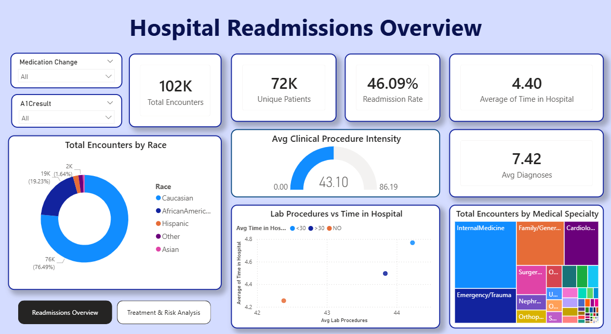
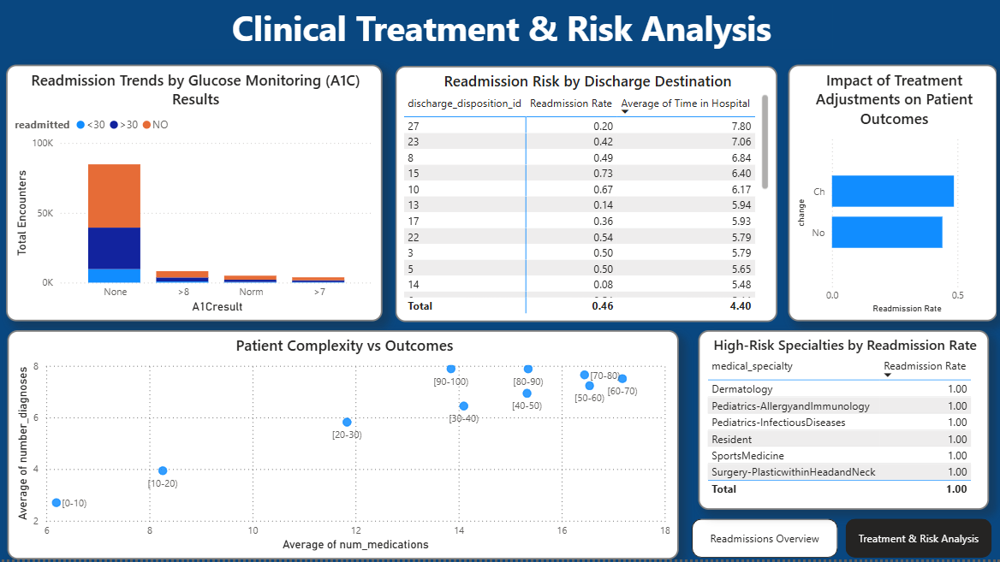

# Hospital Readmission & Clinical Risk Analytics

This project addresses a critical challenge in healthcare: Patient Readmission. Using a dataset of over 100,000 clinical encounters from 130 US hospitals, I engineered a relational database and an interactive Power BI suite to identify the clinical and demographic drivers of hospital returns.

Data Source: Diabetes 130-US hospitals for years 1999-2008 Data Set, sourced from the UCI Machine Learning Repository.

[Access Dataset Here!](https://archive.ics.uci.edu/dataset/296/diabetes+130-us+hospitals+for+years+1999-2008)

## Tech Stack
- Database: MS SQL Server (T-SQL)

- BI Tool: Microsoft Power BI

- Data Modeling: Star Schema (Fact & Dimension Tables)

- Concepts: ETL, Data Cleaning, DAX, Health Informatics

The raw data was initially a flat "unstructured" CSV. I performed the following engineering steps to prepare it for analysis:

SQL ETL: Cleaned missing values (represented as ?) using NULLIF and CASE statements.

Relational Mapping: Deconstructed the flat file into a Star Schema to improve query performance and data integrity.

Fact_Encounters: Metrics for 102k hospital visits.

Dim_Patients: Cleaned demographic data for 72k unique patients.

Dim_ClinicalDetails: Metadata for admissions and medical specialties.

Integrity Fix: Resolved 1-to-Many relationship conflicts by aggregating patient data to ensure unique primary keys in dimension tables.

## Dashboard Preview

## 📊 Dashboard Insights

Page 1: Hospital Readmissions Overview

Volume vs. Risk: Tracks 102k encounters against a 46.09% readmission rate.

Clinical Intensity: A gauge monitoring the average of 43.10 lab procedures per visit.

Demographic Distribution: A donut chart analysis showing the impact of race on hospital volume.

Page 2: Clinical Treatment & Risk Analysis

Patient Complexity: A scatter plot correlating the number of medications and diagnoses across age brackets, revealing that complexity peaks in the 70–90 age group.

A1C Monitoring: Identifies a massive volume of patients with "None" for A1C testing, highlighting a gap in chronic glucose monitoring.

Treatment Efficacy: Analyzes how medication changes (Ch vs No) impact the likelihood of readmission.

## 📈 Summary of Findings

Complexity is the Key Driver: Readmission risk scales linearly with the number of diagnoses and medications.

Monitoring Gaps: A significant portion of the population is not receiving A1C testing, which correlates with higher return rates.

High-Risk Cohorts: Identified specific medical specialties (Dermatology, Pediatrics) with outlier readmission profiles.

## How to Run

Database: Execute the script in /SQL_Scripts/Model_Setup.sql to create the schema and clean the data.

Report: Open the .pbix file in the /PowerBI_Report folder to view the interactive dashboard.
